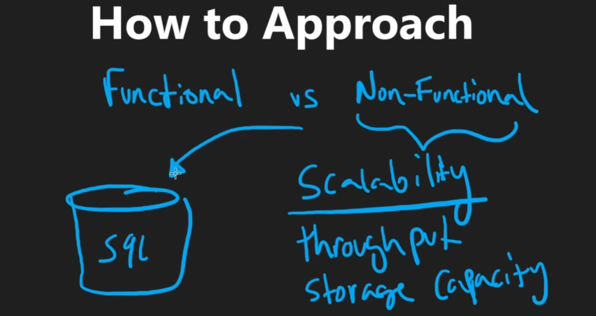

# System Design

**Number one is to clarify the requirements and dont make assumptions**

1. What is the functions? 
2. What features do we want to include?

Clatify these then clarify the following
1. Scalability (throughput and storage capacity)
   1. How many request per second
   2. How much data do we need to store?
2. Performance 
   1. (latency issue) Read vs. Write which one to optimize
   2. Availability of the server i.e., downtime 
      1. Is the improvement worth the cost? 

### Back of the envolope estimates of read and write
i.e., 100m developers with 100 reads each and then 10 writes - Then throughput is 

second per day ~ 100k
read throughput = #Read / seconds per day
write throuput = #Write

- 1k = 1000 -> 
- 100,000 -> 1 read/write per second
- 1,000,000 -> 1 million -> 10 read/write persecond

https://colin-scott.github.io/personal_website/research/interactive_latency.html

Have a general high level overview for this approach