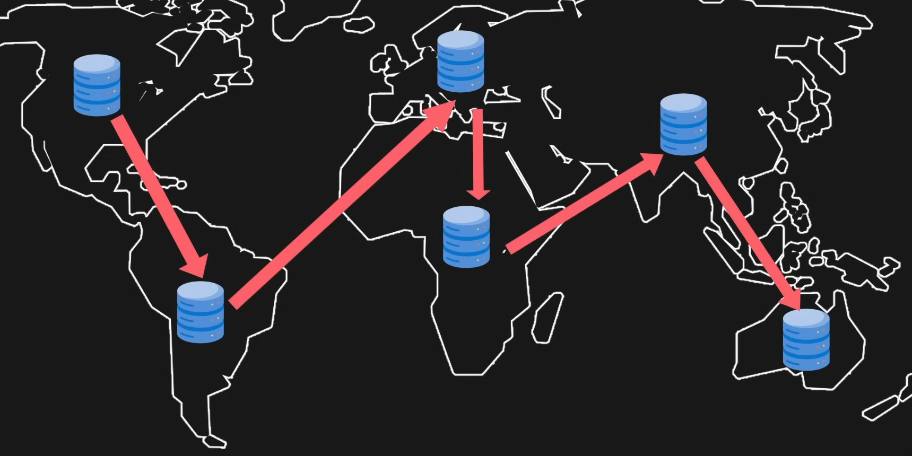
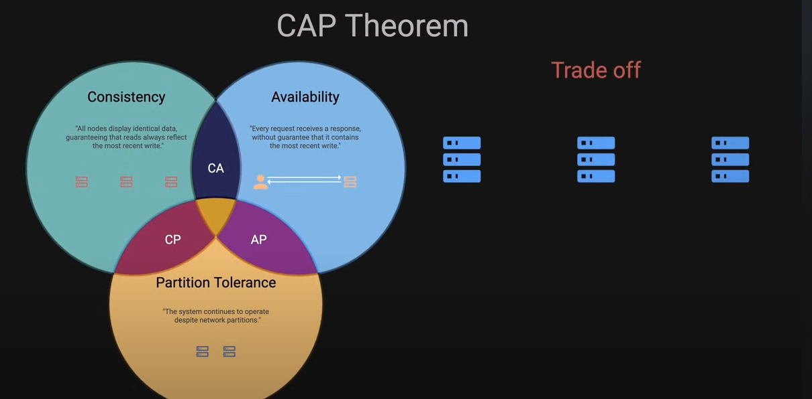

# Application Architecture

Developer - build and deplay - server- storage

1. Single server request and response
   1. Vertical scaling (ram) or replicas (horizontal scaling)
   2. Redudancy and fault toltance

Watched this video - Isleep!
https://www.youtube.com/watch?v=i53Gi_K3o7I
Reverse balancer round robind

CDN =  network of serverse around the world and copies to CDN server

Caching - save data for later quick access

TCP/IP = HTTP and WebSocket dpend on 

WebSockets is really good for chat applications
- Immediately get information in realtime application

Databases are more efficient ATOM AS WELL

Sharding

Read-Write database replication..

CAP theorem hmm

Last is message queues 
- Shard for scalability
- Replicate for redudancy

**Its just storing and moving data and always has been**

Another video
https://www.youtube.com/watch?v=FxAom29OEKE
Scale mllions of users
Distrubuted systems have this error CAP theorem trade off 
- Horizontal scalling distrubutable systems

1. C - cONSISTANCY do all nodes show the same data
2. \Avaialbility how available the data is
2. Partition tolerance continues to operate despite network partition

SQL 
- easy for ETL read
- Rigid (scales vertical but need sharding)    
- ACID
NoSQL - good for write
- Scales vertically
- not ACID

Some consistance to acid

SQL is good for critical applications with structured and consistant data

NoSQL is good fo large volumes of unstructured data