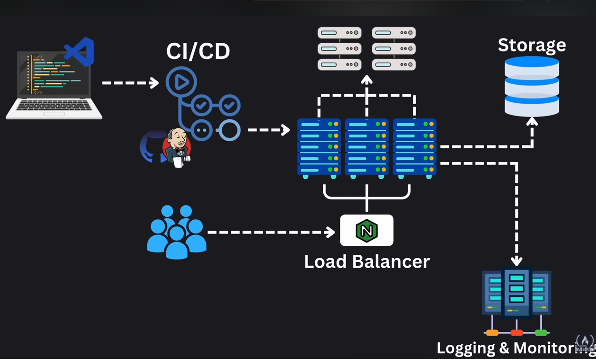
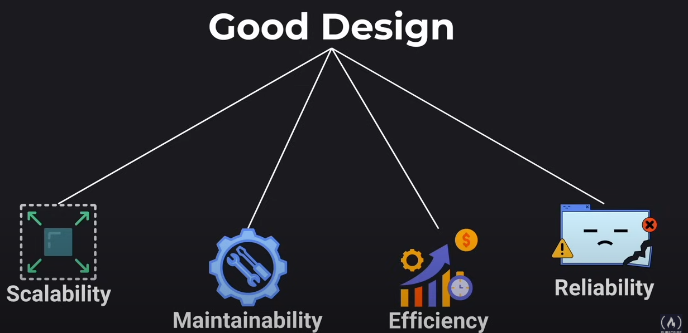
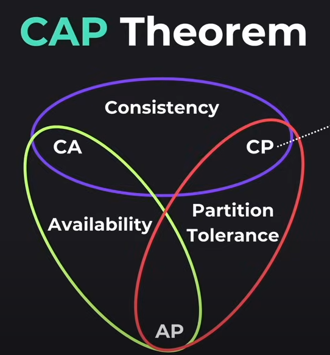
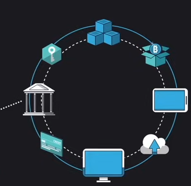
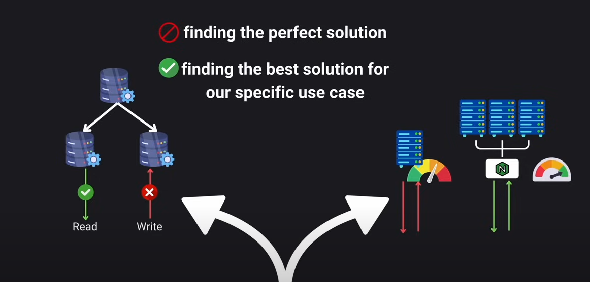
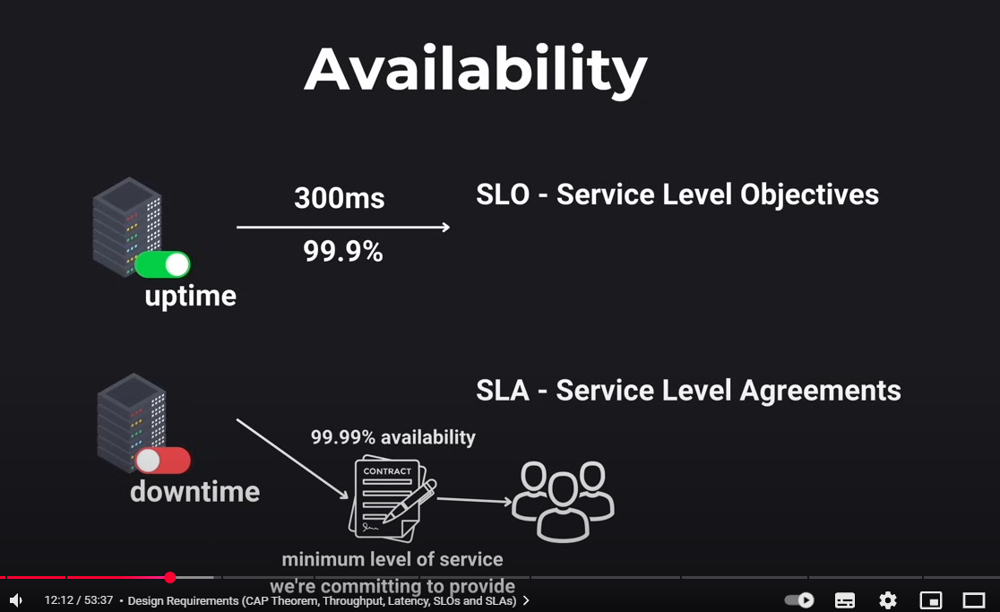

# FreeCode Camp
https://www.youtube.com/watch?v=F2FmTdLtb_4

1. CI/CD 
   1. pipeline with jenkins and github actions
   2. then in productions it gneeds a load balancer

- Senrty can capture errors on the front end, and PM2 the backend
- Any issues go to the alert service which can notify the users

## Debugging and monitoring 
- View the logs, then test in staging/testing
- Fixbug then push through github actions and things to production

### What is goood design
1. Scale
2. Maintain
3. Efficiency
4. Reliability

The Key to everything is **moving**, **storing** and **transforming** data.

### CAP theorem
- Consistancy google docs is consistnat for everyone
- Avaialbility - the server is online i.e., online shopping
- Partition tolerance i.e., a group chat one person goes down it still workds

**Crucial networks fall into the CP region**
- Consistancy and Partition Tolerance such as a 

CA: Consistancy and Avaialbility - Needs to serve customers but fails if a network node disconnects i.e., payments ecommernce - doens't really care if it goes downabit due to network
1. Banking system
2. Medical Records

AP: No need for strong consistancy such as DNS look up or user cart
1. DNS server domain name
2. EEbay and shopping carts - SHopping carts may be out of sync but will eventaully sync up during chekout
Trade offs everywhere 
- If we want read then writes will be worse

About finding the best solutio nfor out usecase

### Availability 
5 9's golden rule is around 5 minutes of downtime
SLO= Server level objectives
SLA - Server Level Agreements

