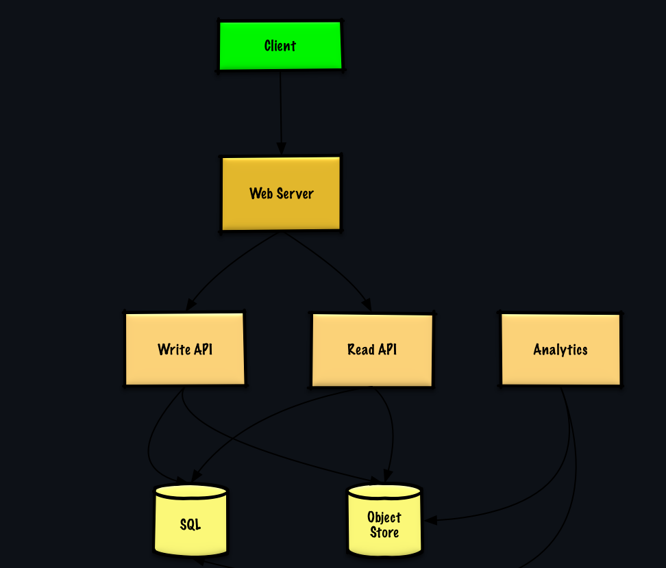

# Design Bitly a URL shortening service

URL shortening so we need to have what does the user want to do?
- Clarify the requirements

Assume that the user wants to input a url 123512312.gasdfas.com and wants to shorten it SO
abc.bitly -> 123512312.gasdfas.com

Thus we need a map from their URL to our shortened URL. 

1. Design the frontend for this service - web front end hosted on our server
2. Build the API point to submit their long url
3. Deliver the shortened URL

How they will use it will be bitly will host a DNS server .bitly extensions all go to our server
our server will then redirect them to the correct page

## Further clarification
1. User enters a long URL
   1. A short one gets returned random
   2. The short URL will expire (can be set)

2. Out of scope
   1. Accounts, set url, edit documents

High level the client, webserver write, read api and sql object store

Pastebin now.

If pastebin - we can map the generatl URL in a relationdatabase to a Object Store database (such as Amazon S3), when the user goes to the URL the API will read from the object store and let the user see the contetns.

What is the order of the write:
1. User generates a page
2. Calls Write API
3. Write API generates a random URL and a location in the object store
   1. Checks unique URL in SQL database
4. Return user the blank empty page

When a user updates that page it will call the write URL and use a session token + url to write to the previously defined location