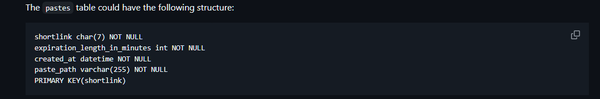
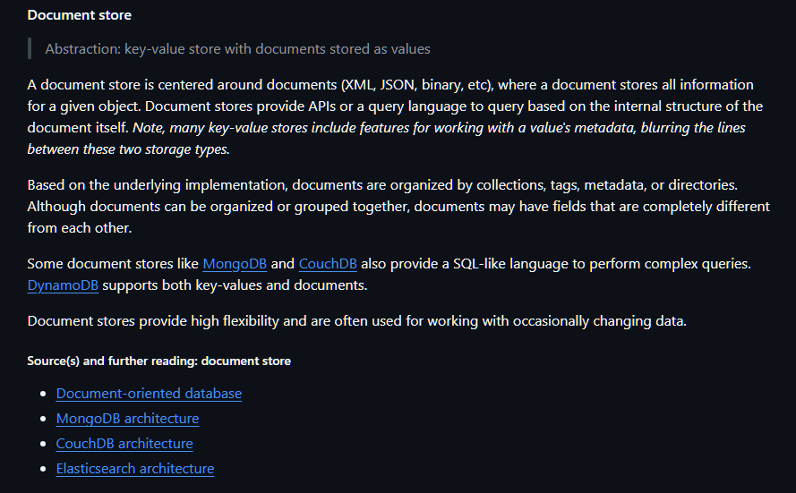
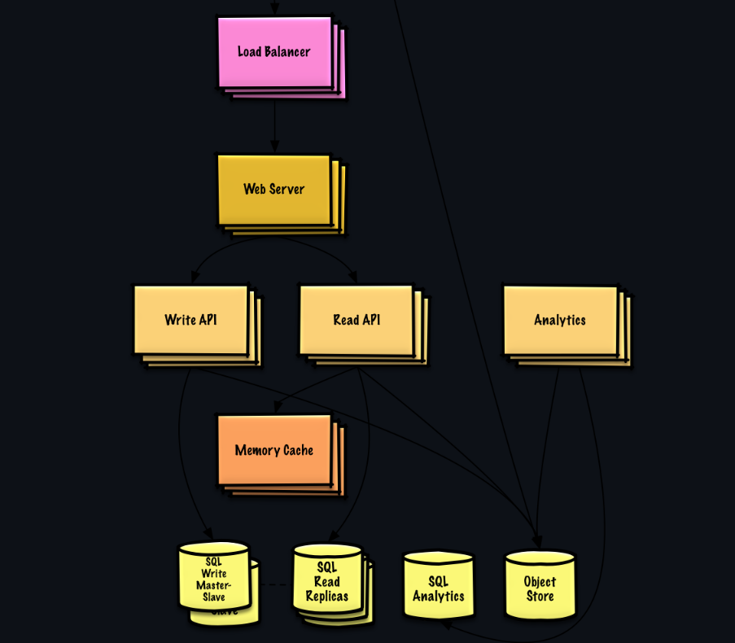

1. Designing Bitly

Generate the URL short by using a hash algorithm such as MD5 using the original url and some information

Storing paste into the RDB (relational database) could store information such as:

ORIGINAL URL AS CHAR
TIMESTAMP AS DATETIME
EXPIRY AS DATETIME
INDEX

RDB (Hashmap) -> indexes into -> NoSQL paste document database
 Like MongoDB

by using index we can improve the read time to the object database such as S3 which contains the action information

Requires Read API and Write API

Reverse Proxy the sever hehe so it will communicate to the appriate API depending on the Rest request

## Scaling up

Before scaling up we need to do the three steps:
Load Testbenchmark, Profile on bottle necks, evaluating alternatives and tradeoffs

1. Multiple webservers
2. Loadbalancers
3. Multiple Read and Write API servers
4. Memory cache to multiple databases

Database splitting readwrite master, read replicas

And finally ANALYTICS on the API calls

Analytics could be amazon datawarehousing like RedShift

Next https://github.com/donnemartin/system-design-primer/blob/master/solutions/system_design/scaling_aws/README.md